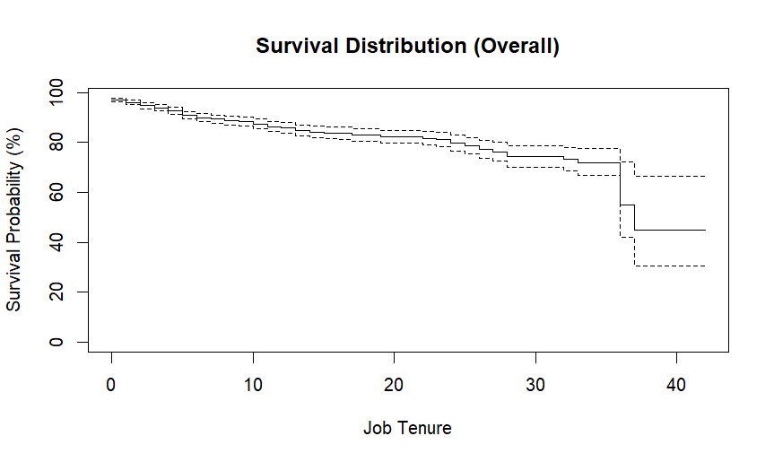
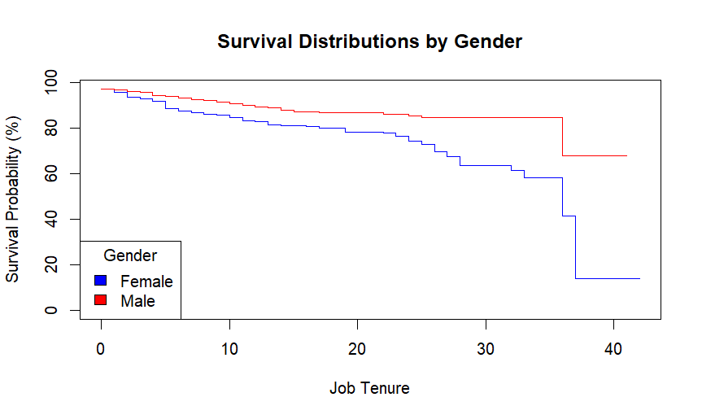

# Advanced People Analytics
**Tools and methods for advanced analysis** 

[Go to the End](#end)

In this part, a review of tools and methods is provided with code examples for each one, and then detailed examples are presented in the sub-sections. 

## Table of Contents
- [Chi-square analysis](#chi-square-analysis)
- [Logistic Regression Analysis](#logistic-regression-analysis)
- [Survival analysis](#survival-analysis)

## Chi-square analysis
When both Dependent Variable (DV) and the Independent Variable (IV) are categorical (binary, nominal or ordinal), and there is only one IV, then Chi-square analysis is used.

It analyzes if the frequencies and proportions across particular categories are related to changes in another category. 

For instance, imagine we have workforce data of a company with 562 employees working at 3 different levels. One level is non-managerial and the two others are managerial levels.
So, we can check if there is statistically significant relationship between gender and managerial position. It is like calculating the frequency of men and women in the company and then see whether they are in managerial or non-managerial roles. 
By combining these two dimensions, we have four categories:

- male manager
- male non-manager
- female manager
- female non-manager

To check the significance of this relationship, we conduct a chi-square test. It compares the frequencies observed with the expected frequency. If there is no relationship, we can conclude the observed difference could be gained by chance. 

The chi-square statistic is calculated as:

$X^2 = \sum \frac{(O - E)^2}{E}$

where:
- $O$ is the observed value
- $E$ is the expected value

then the chi-squared statistic checked against a distribution with known properties along with the degrees of freedom, calculated as (r-1)(c-1) where r and c are our data dimensions, to find the p-value. 

***Explanation of the example for binary DV***

***Explanation of the example for non-binary categorical DV***

The chi-square analysis is used when the relationship between two categorical variables is analyzed. For more than two categorical variables, loglinear analysis should be done. 

[Back to the Table of Contents](#table-of-contents)

## Logistic Regression Analysis

Logistic regression is used when the DV is binary; so, we can have a combination of categorical and continuous variables as IVs. 
The method includes the following steps:
	- Calculating the model's Chi-square: to test how well the model fits the data by comparing the observed versus the expected values. 
	- Modeling chi-square p-value: to evaluate the statistical significance of the overall model
	- Calculating the Nagelkerke R-square: an estimation of the percentage of variation explained by our model
	- Calculating the p-value of each IV: to analyze which IVs potentially significantly impact the DV
	- Analzying the odds ratio (Exp(b)): to indicate the odds or probability of the occurence in the DV, incurred by one unit change in each IV. 

The logistic regression model is defined as:

$P(Y) = \frac{1}{1+e^{-(b_0 + b_1X_{1i} + b_2X_{2i} + \dots + b_nX_{ni})}}$

where:
- **P(Y)**: Probability of the event occurring
- **b0**: Intercept
- **b1, b2, ..., bn**: Coefficients
- **X1, X2, ..., Xn**: Predictor variables

When the DV is binary, then the analysis is called a binary logistic regression. If it is not binary, then we have a multinomial logistic regression. 

### Example

In the example, we want to predict if recommending working for a company (collected through a survey) is based on gender or position in the company.
- Gender is binary (male-female)
- Position has five levels (one operational level and four managerial levels - junior, middle, upper, top)

| Predictor                  | Estimate  | Std. Error | z-value | p-value  | Odds Ratio (exp(β)) |
|----------------------------|----------|------------|---------|----------|----------------------|
| **Intercept**              | 2.06873  | 0.22351    | 9.256   | <0.0001 *** | 7.91                 |
| **Gender (Male)**          | 0.32659  | 0.16461    | 1.984   | 0.0473 *  | 1.39                 |
| **Position (Middle Mgmt)** | -0.27406 | 0.24213    | -1.132  | 0.2577    | 0.76                 |
| **Position (Operational)** | 0.04427  | 0.26891    | 0.165   | 0.8692    | 1.05                 |
| **Position (Top Mgmt)**    | 1.18681  | 1.03855    | 1.143   | 0.2531    | 3.28                 |
| **Position (Upper Mgmt)**  | 0.28908  | 0.32170    | 0.899   | 0.3689    | 1.34                 |

*Significance codes:*  
- *** `p < 0.001`
- ** `p < 0.01`
- * `p < 0.05`
- `p < 0.1`

Based on the results, we can only infer males are more likely to recommend than females, and the rest of the coefficents are not statistically significant. 

Looking at the Odds Ratios:

| Predictor                  | Odds Ratio (exp(β)) | 95% CI | p-value  | Significance |
|----------------------------|--------------------|--------|----------|-------------|
| **Intercept**              | 7.91               | -      | <0.0001  | ***         |
| **Gender (Male)**          | 1.39               | -      | 0.0473   | *           |
| **Position (Middle Mgmt)** | 0.76               | -      | 0.2577   |             |
| **Position (Operational)** | 1.05               | -      | 0.8692   |             |
| **Position (Top Mgmt)**    | 3.28               | -      | 0.2531   |             |
| **Position (Upper Mgmt)**  | 1.34               | -      | 0.3689   |             |

*Significance codes:*  
- *** `p < 0.001`
- ** `p < 0.01`
- * `p < 0.05`
- No symbol: Not statistically significant (p > 0.05)

**Note:** Only `Gender (Male)` has a significant effect (p = 0.0473). The Odds Ratios for Position categories are **not statistically significant** and should be interpreted with caution.

#### Model Fit Statistics

| Metric                            | Value  | Interpretation |
|----------------------------------|--------|---------------|
| **McFadden's R²**                | 0.0109 | Very low explanatory power |
| **Cox & Snell (ML) R²**          | 0.0074 | Low model fit |
| **Nagelkerke R²**                | 0.0150 | 1.5% of variance explained |
| **Likelihood Ratio Test p-value** | 0.0277 | Model is slightly better than null model |

**Interpretation:**
- The **Nagelkerke R² (1.5%)** suggests the model explains **only a small fraction** of the variation in `Recommend`.
- The **Likelihood Ratio Test (p = 0.0277)** suggests that the model provides **some improvement** over a null (intercept-only) model, but the effect is **not strong**.
- Overall, the model fit is **weak**, meaning more predictive variables or interactions might be needed to improve accuracy.

[Back to the Table of Contents](#table-of-contents)

## Survival Analysis

Also known as event history analysis and duration analysis, it calculates the expected amount of time until an event occurs. In survival analysis, the dependent variable (DV) is categorical, while the independent variables (IVs) can be either categorical or continuous.

### Key Concepts and Use Cases
Some examples of events analyzed through survival analysis include:
- Survival of patients after taking a medicine
- Tenure of employees in an organization
- Factors explaining newcomers' stay in the company

In survival analysis, not all cases enter and leave the analysis at the same time or event during the analysis. In this respect, the censored cases are the ones for whom the event or hazard (e.g., death or departure) did not occur within the duration of the observation.

### Methods of Survival Analysis

**Life Tables**
- Subdivides the duration of the study into smaller time periods.
- Estimates the probability of the event occurring during each time period.
- Mainly used for large samples.
- Less commonly used than Kaplan-Meier.

**Kaplan-Meier (KM)**
- Calculates nonparametric estimates of survival and hazard rates.
- Uses log-rank tests to assess statistical significance between groups.
- Suitable for non-parametric data.
- Visualizes survival distribution using step functions.

**Cox Regression Analysis**
- Similar to logistic regression analysis.
- Estimates the hazard ratio to show how changes in independent variables affect the likelihood of the event over time.

---
### Example: Survival Analysis of Employee Turnover

The primary objective of this example is to understand factors influencing employee retention and turnover by analyzing survival times (length of service) and leaver status. Additionally, it evaluates the impact of gender on job tenure and visualizes survival curves to identify significant differences between groups.

#### **Steps of Analysis**
1. **Data Loading and Preprocessing:** Load the CSV file, convert variables to factors, and inspect data distributions.
2. **Overall Survival Analysis:** Calculate the overall survival curve using Kaplan-Meier.
3. **Gender-Based Survival Analysis:** Generate separate survival curves for males and females.
4. **Statistical Testing (Log-Rank Test):** Assess whether survival distributions differ significantly between genders.
5. **Visualization:** Plot survival curves and annotate gender differences.

#### **Results**
The analysis reveals that male employees tend to have longer job tenure compared to females. The difference in survival patterns between genders is statistically significant, as indicated by the log-rank test (p < 0.001). This suggests that gender is an influential factor in employee retention. The survival curves and statistical tests provide valuable insights into factors impacting employee tenure.

#### **Key Outputs and Interpretations**
- **Overall Mean Survival Time:** 32.7 years
- **Male Mean Survival Time:** 35.9 years
- **Female Mean Survival Time:** 29.1 years
- **Log-Rank Test Result:** Chi-squared = 21.6 on 1 degree of freedom (p = 3e-06)
  - This highly significant result indicates that male employees have statistically significantly longer job tenure than females.

#### **Visualization**
The survival analysis results are presented in the following plots:

1. **Overall Survival Distribution:** This plot shows the overall survival curve for employee tenure without considering gender differences. It illustrates the probability of survival (job retention) over time.

2. **Gender-Based Survival Distribution:** This plot shows separate survival curves for male and female employees, highlighting the differences in job tenure between genders. The male survival curve consistently remains higher than the female curve, indicating longer average tenure for males.

#### **Conclusion**
This survival analysis effectively highlights the differences in job tenure between male and female employees. Understanding these differences can support targeted retention strategies and inform HR policies aimed at reducing turnover.

[Back to the Table of Contents](#table-of-contents)